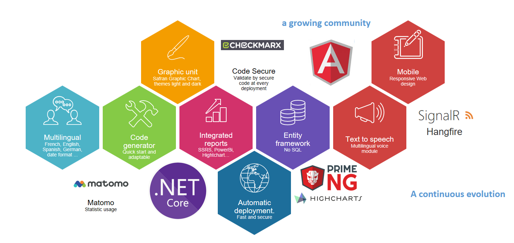
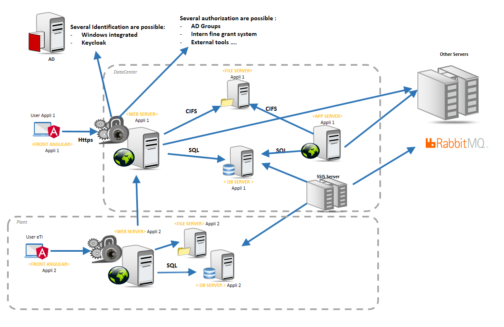
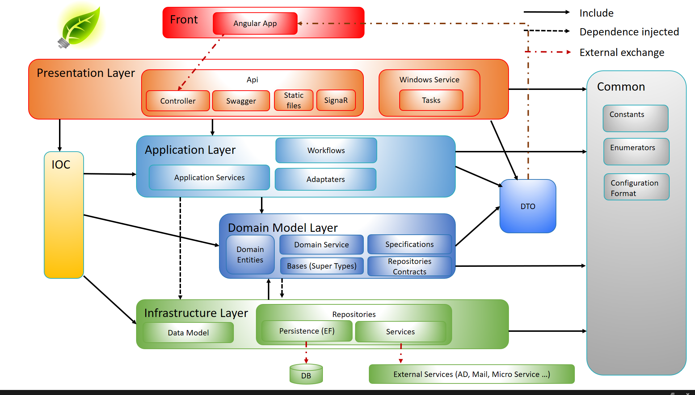

# What is BIA Framework

## Goal of the BIA Framework:
The goal of BIA Framework is to develop on **faster and secure way** professional applications.
The development is oriented to be done by a DevOps team and **reduce the workload to maintain** the application.
At the end the global effort to develop and maintain the application is optimized.

The spirit is close to the principle of micro service:
Every application design with the framework is independent to reduce risk and test cost at deployment.
But the applications can communicate together.
Creating a new app is very fast => you can easily multiply the number of application.
Migrate them is automatic and can be done independently.

The framework onboard a lot of native Features describe in the [Developer Guide](../../40-DeveloperGuide/DeveloperGuide.md).

The configuration and design of the applications generated can be customize by each Company which use the framework.
This customization can be place in a git repository to be share with every developer inside or outside the company.

The framework is in constant evolution to add major functionalities, add compatibilities and follow the version of component.

## Module Overview:
The framework is in improvement since 2016 on concrete application in factories.
In the V3 of this framework we have select the following modules to accelerate the development and secure 
maintainability.

## Run Overview
Each application designed with the framework or compatible with an execution on distributed server.
It support Load balancing and worker service can run on several server.

Example of 2 applications design with the BIA Framework:
* Appli 1 : user prepare data. It is host in a central data center
* Appli 2 : user use the prepared data in an plant. The application is hosted on server close to user to never stop the production in case of network failure.

 

## Domain Driven Design
The application generated respect the driven design approach to be modular.

