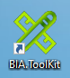

# Setup BIA Tool Kit 

* Find or create the BIAToolkit ClickOnce install package
  * Ask to your teammate if an BIAToolkit ClickOnce install package is store on the local network.
  * If not create it with the instruction [Publish BIA Tool Kit in click once](../../30-BIAToolKit/90-PublishBIAToolKitInClickOnce.md)
  
* Install the tool kit : 
  * Open folder \\\\share.bia.[MyCompany]\\BIAToolKit\\
  * Double click on setup.exe
  * Click on Install
  * This creates a link on the desktop that always launches the latest version. (and will also work offline)
  
  * To pin a ClickOnce application in the Windows bar you have to drag and drop the desktop link. And not pin it to the program once launched (otherwise there is no verification of the latest version at launch)
  * The settings will have to be re-entered the first time, then click on the "Save settings" button. They will be kept after each version upgrade.

* Configure : follow the page [Configure the BIA tool kit](../../30-BIAToolKit/10-ConfigureTheBIAToolKit.md)