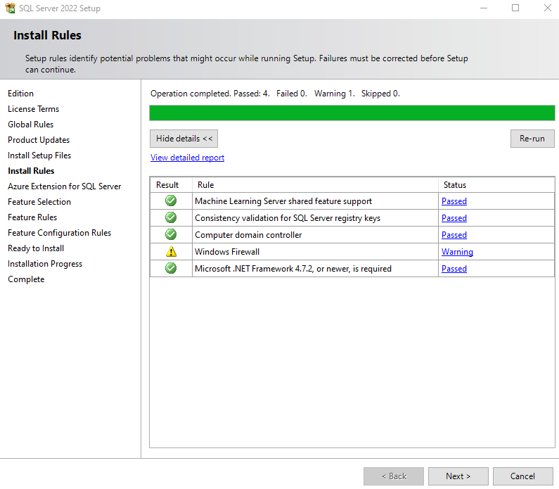

# Setup Database 
## To work with SQL Server:
Install [SQL Server](https://www.microsoft.com/en-us/sql-server/sql-server-downloads)
You can choose SQL Server 2022 Developer that is free. (But be careful you cannot install it on production server)
After downloading the SQL Server 2022 Developer, double click on the icon to start the install process.

 - Choose "CUSTOM" option
 
 
 - Either specify an install location or let it as is, then click on "Install"
 

 - Choose "Installation" on the left side, and select "New SQL Server standalone installation or add features to an existing installation" first option from the list
 

 - In "Specify a free edition:", leave "Developer" as default
 

 - Accept the license terms and click Next
 

 - It will run check for Install Rules and click Next
 

 - Uncheck "Azure Extension for SQL Server" and click Next
 

 - Check "Database Engine service" and click Next
 

 - Select "Default instance" and click Next (Need to remember Instance ID to be able to login in SSMS)
 

 - Click Next in the "Server Configuration" screen

 - Choose "Windows authentication mode", **then IMPORTANT add your account as SQL Server administrator by clicking on "Add..." button**
 

 - Review the summary, click Install, and close the setup windows
 

At the end of the installation
[Install SSMS](https://learn.microsoft.com/en-us/sql/ssms/download-sql-server-management-studio-ssms)

## To work with PostgreSQL:
Install [PostgreSQL](https://www.postgresql.org/download/)
To browse the base you can use (pgAdmin 4)[https://www.postgresql.org/ftp/pgadmin/pgadmin4/v6.15/windows/]
