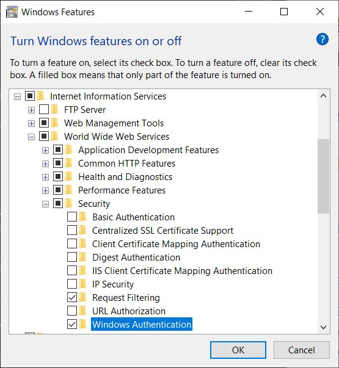
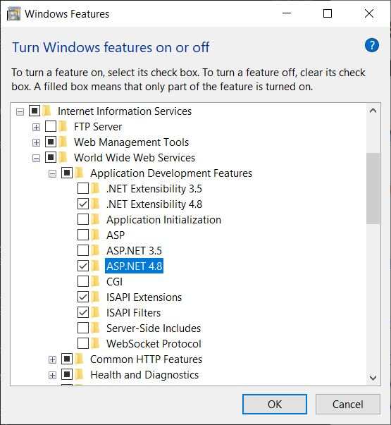
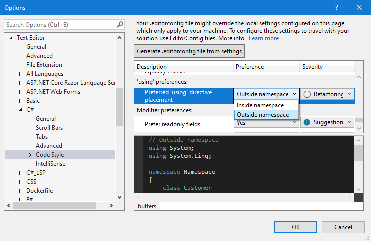
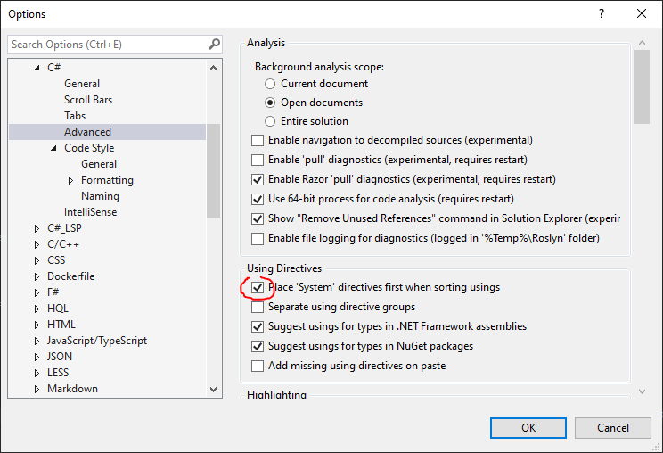

# Setup dotnet development environment:

## Minimum requirements

### Visual Studio 2019 & components
**Installation :**

Install [Visual Studio](https://visualstudio.microsoft.com/fr/vs/) 

- Install/update Visual studio with Admin account without internet access.
  * Ask to your teammate if an the Visual Studio install package is store on the local network.
  * If not create a share folder bia and prepare yourself the package with the command:
  ```
  cd '\\share.bia.[MyCompany]\VSPro2022\VS Pro 2022 Setup\'
  .\vs_Professional.exe --layout '\\DMShare\VSPro2019\VS Pro 2019 Setup' --lang en-US fr-FR es-ES
  ```
  * Launch \\\\share.bia.[MyCompany]\VSPro2022\VS Pro 2022 Setup\vs_Professional.exe with your Admin account. 
  * Before click install or update your version click on "More" >  "Update settings" 
  * Select the channel "Private Chanel" 
  * Click ok.  
  => By using the private chanel, you can install or update your Visual studio by clicking on Launch or update. 
  => If a new version is available in \\share.bia.[MyCompany]\VSPro2022\VS Pro 2022 Setup\ a popup will warn you in Visual Studio. 

- Add the latest SDK of .NET Core from the components list:
- Add [Development Time IIS Support](https://devblogs.microsoft.com/aspnet/development-time-iis-support-for-asp-net-core-applications/) follow the blog instruction with this additional tips: 
  When installing IIS, make sur that 
  * "WWW Services -> Security -> Windows Authentication" is checked 
  
  * "WWW  -> App Dev Features -> ASP.Net 4.x" is h
  
  * And restart IIS
  
  If Visual Studio 2022 is already installed, you can add those components by launching the VS Installer.

**Configuration :**

Set your "using placement" code style setting to **inside namespace**
Code style settings are available from Tools > Options > Text Editor > C# > Code Style.


**Enable** your "Place 'System' directives first when sorting usings"
This setting is available from Tools > Options > Text Editor > C# > Advanced 


### Variable Environment
create the following system environment variable:  
Name: ASPNETCORE_ENVIRONMENT  
Value: Development  
The IIS server must be restarted in order that this variable is taken into account


