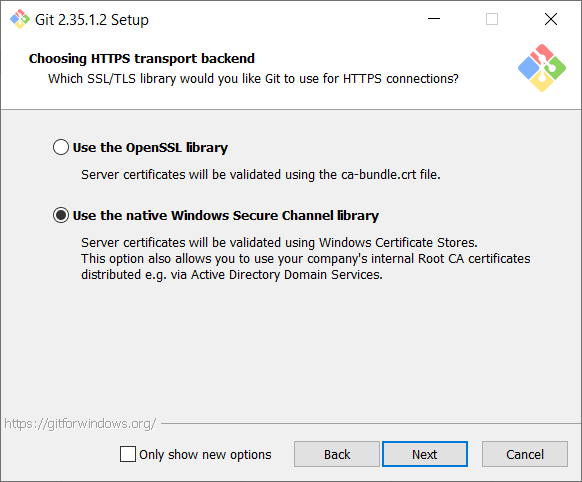

# Setup Git environment 

Install [Git for windows](https://git-scm.com/download/win)
When working for a company behind a proxy with certificate interception, it is advised to choose "Use the native Windows Secure Channel library" in order to validate server certificates with Windows Certificates Stores

In order to avoid to do unnecessary merges it is also advised to configure the default behavior of "git pull" to "pull rebase"
When working only on Windows, in order to avoid issues with line feeds, choose the "Checkout as is, commit as" option

The git plugin for Visual Studio is automatically installed by default with Visual Studio but you can also install a dedicated GUI client (for instance [Git extensions](https://gitextensions.github.io/))
if behind a company proxy, in order to be able to fetch a github repo, run the following command :
```cmd
git config --global http.https://<area>github.com.proxy [**add_here_your_proxy_url**]
```

this should add the following lines to your **.gitconfig** file
```
[http "https://github.com"]
	proxy = [proxy_url]
```

To find the path to the **.gitconfig** file, type the following command:   
`git config --list --show-origin`   


Add your name and email in your **.gitconfig** file, by adding a section like this:
```
[user]
	name = [**add_here_your_first_name**] [**add_here_your_last_name**]
	email = [**add_here_your_email**]
```