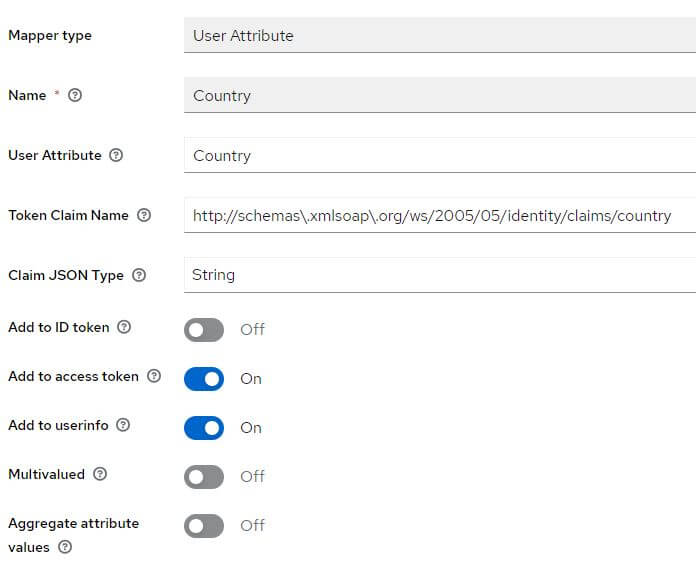

# Initialize Keycloak

This file explains how to initialize Keycloak for use with a BIA application.

We will take the connection with an LDAP as an example.

## Realm
Never modify the **Master** realm.

Create a new **Realm**, for example **BIA-Realm**

## User federation
Create a new **User federation**, configure it and check that everything is ok with the buttons **Test connection** and **Test authentication**

Among the fields requested in the **User** table in database, look at what the **User federation** contains. If any are missing, create the corresponding mappers.

For **Groups**, don't forget to fill the field **LDAP Groups DN**. For example: ***OU=Roles,OU=Groups,OU=DM,OU=Service,OU=XXXXXX,DC=eu,DC=xxxxxx,DC=xxxxxx***

At the top right, select from the list, **Sync all users**

## Client
Create a new client, for example, biaapp and fill **Root URL** and **Admin URL** with the root of your applications' URLs (example: https://myapp-int.mydomain/)

Go to the tab **Client scopes** and click on the link **biaapp-dedicated** contained in the table with the description: **Dedicated scope and mappers for this client**

 

 If they are missing, add them:

 

 

 

 

 

 

 

 

 ## Role client
  
 Go to **Realm Roles**, create the role **bia-app-admin** and **bia-app-user-manager**.
  
 ## Group
 
Go to **Groups**, create the group **APP_Admin** and the group **APP_BIADemo_UserManager**

Click on the group **APP_Admin** and map the role **bia-app-admin**

Click on the group **APP_BIADemo_UserManager** and map the role **bia-app-user-manager**

For group **APP_Admin** and **APP_BIADemo_UserManager**, click on **Members** tab and add users.

## Service Account

You must create a user in Keycloak which will be used to query the list of users in your realm.

In your realm, go to the **User** tab and create a user. Once created, create a non-temporary password.

Go to the **Role Mapping** tab and click on **Assign Role**

Select **Filter by clients** and select the following roles:

- **realm-management** query-users
- **realm-management** view-users

