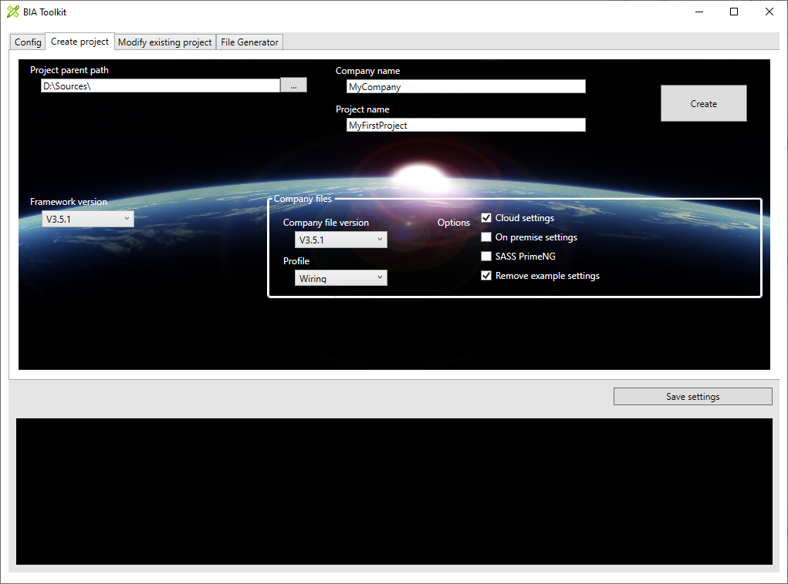

# Create project with the BIA tool kit
This document explains how to create a project with the BIAToolKit.



## Prerequisite
You need to have configure your tool kit. [Describe here](./10-ConfigureTheBIAToolKit.md).


## Set the project parent path
It is recommended to develop all your BIA projects in a folder. In the Project parent field select this folder. 
It is recommended to have the BIADemo project cloned in this folder (to be available to debug packages)
The Organization will be:
```
ProjectParentPath/  
├───BIADemo/
│   ├── .../  
│   ├── BIAPackage/
│   │   ├── BIA.Net.Core.Application/
│   │   ├── BIA.Net.Core.Common/
│   │   └── ...
│   ├── .gitignore
│   ├── README.md
│   └── ...
├── YourProject1/
│   ├── Angular/   
│   ├── DotNet/ 
│   ├── .gitignore
│   ├── CHANGELOG.md
│   ├── package-lock.json
│   └── README.md
└── YourProject2/
    ├── Angular/
    ├── DotNet/
    └── ...
```

## Set the company name and project name
The company name and project name will appear in the namespace of the application :
``` csharp
namespace [CompanyName].[ProjectName].Presentation.Api
```

The project name will be use as folder name (under ProjectParentPath) and in a lot of files (code, setting, config ...)

## Save the settings
Click on the save settings button to save the "Project parent path" and "Company name". The configuration is save for the next start of the BIAToolKit.

## Select the version and option.
You can select the version of the framework and if you have Company files you can select the version of the company files (corresponding to the framework version) and profiles and option.
Generally the profiles impact the design (background picture, colors...) and the option are related to the configuration. But all is possible and you should consult your company files administrator to have the details.

## Create the project
Click on the create button to create the project. It will be create in  [ProjectParentPath]/[ProjectName]
