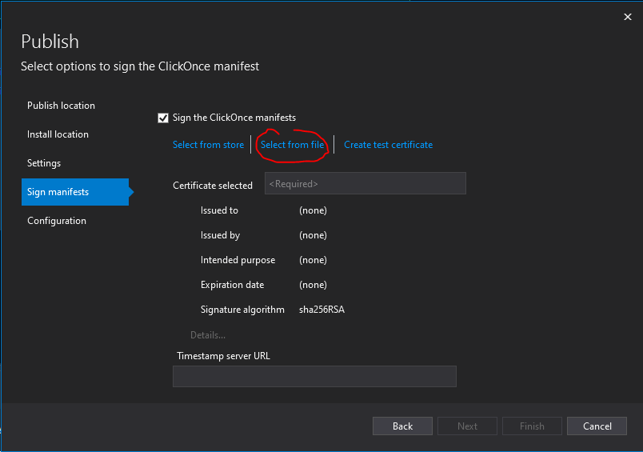

# Publish BIAToolKit in click once
This document explains how to publish the BIAToolKit in click once on a shared folder to simplify the usage and update for every developer

## Obtain a signing code certificate
You have to obtain a certificate for code signing trusted by you company.
Place it in the folder BIAToolKit\BIA.ToolKit\Properties\PublishProfiles

## Create the publish file
Create a file BIAToolKit\BIA.ToolKit\Properties\PublishProfiles\ClickOnceProfile.pubxml
with the following content (replace \\share.bia.[MyCompany]\ by the path of the shared folder):

```xml
<?xml version="1.0" encoding="utf-8"?>
<!--
https://go.microsoft.com/fwlink/?LinkID=208121. 
-->
<Project ToolsVersion="4.0" xmlns="http://schemas.microsoft.com/developer/msbuild/2003">
  <PropertyGroup>
    <ApplicationRevision>1</ApplicationRevision>
    <ApplicationVersion>1.2.0.*</ApplicationVersion>
    <BootstrapperEnabled>True</BootstrapperEnabled>
    <Configuration>Release</Configuration>
    <CreateDesktopShortcut>True</CreateDesktopShortcut>
    <CreateWebPageOnPublish>False</CreateWebPageOnPublish>
    <GenerateManifests>True</GenerateManifests>
    <Install>True</Install>
    <InstallFrom>Unc</InstallFrom>
    <InstallUrl>\\share.bia.[MyCompany]\BIAToolKit\</InstallUrl>
    <IsRevisionIncremented>True</IsRevisionIncremented>
    <IsWebBootstrapper>False</IsWebBootstrapper>
    <MapFileExtensions>True</MapFileExtensions>
    <MinimumRequiredVersion>1.2.0.0</MinimumRequiredVersion>
    <OpenBrowserOnPublish>False</OpenBrowserOnPublish>
    <Platform>Any CPU</Platform>
    <PublishDir>\\share.bia.[MyCompany]\BIAToolKit\</PublishDir>
    <PublishUrl>\\share.bia.[MyCompany]\BIAToolKit\</PublishUrl>
    <PublishProtocol>ClickOnce</PublishProtocol>
    <PublishReadyToRun>False</PublishReadyToRun>
    <PublishSingleFile>False</PublishSingleFile>
    <RuntimeIdentifier>win-x64</RuntimeIdentifier>
    <SelfContained>False</SelfContained>
    <SignatureAlgorithm>sha256RSA</SignatureAlgorithm>
    <SignManifests>True</SignManifests>
    <TargetFramework>net5.0-windows</TargetFramework>
    <UpdateEnabled>True</UpdateEnabled>
    <UpdateMode>Foreground</UpdateMode>
    <UpdateRequired>True</UpdateRequired>
    <WebPageFileName>Publish.html</WebPageFileName>
  </PropertyGroup>
  <ItemGroup>
    <BootstrapperPackage Include="Microsoft.NetCore.DesktopRuntime.5.0.x64">
      <Install>true</Install>
      <ProductName>.NET Desktop Runtime 5.0.7 (x64)</ProductName>
    </BootstrapperPackage>
  </ItemGroup>
</Project>
```

## Publish
In visual studio open the solution and right click on project BIA.ToolKit and click publish.
In "More action" click edit.
With "Next" go to the step "sign manifest" and select the certificate. Enter the password if required.


Click finish
Now click Publish button it will publish the BIAToolKit in click Once in the share folder.
Next time you do not need to reset the certificat.

## Inform the users
Send to all developer following message
```
BIAToolKit in ClickOnce

The BIAToolKit is available in ClickOnce by installing it via this link:
\\share.bia.[MyCompany]\BIAToolKit\setup.exe

=> This creates a link on the desktop that always launches the latest version. (and will also work offline)
=> To pin a ClickOnce application in the Windows bar you have to drag and drop the desktop link. And not pin it to the program once launched (otherwise there is no verification of the latest version at launch)
=> The settings will have to be re-entered the first time, then click on the "Save settings" button. They will be kept after each version upgrade.
```