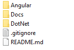

# Create a new project

If you want to start a new project, you have to create the Frontend and/or the Backend project(s) depending on your needs.

You have to respect the structure below for your project :  

To accomplish this, follow the steps below in the right order : 
1. Create and clone a Git repository for the project from Azure DevOps, GitLab or GitHub...
2. Create the project using the BIAToolKit in this folder. [Step describe here](../../30-BIAToolKit/20-CreateProject.md).
3. Update the README.md file with a description of your project.
4. Prepare the DotNet project :
* Prepare the database
	* Follow the steps " Preparation of the Database" in [Infrastructure data project](./50-InfrastructureDataProject.md)
* Prepare and run the Presentation WebApi:
	* Follow the steps "Prepare the Presentation WebApi" in [Presentation API project](./30-PresentationApiProject.md)
5. Launch Project.
* Your should now be able to launch your [front project](./60-RunFront.md)

