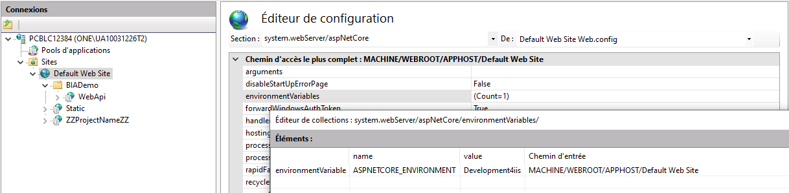

You have 2 alternatives to run this project: 
* use IIS express
  * advantage : faster to configure 
* use IIS
  * advantage : no need to run visual studio each time
  
# Presentation API project
If you do not use a BIACompany file you should create 5 settings files :
  - appsettings.Development.json (in DeployDB project)
  - [For IISExpress] appsettings.Development.json and bianetconfig.Development.json (in Presentation.Api project)
  - [For IIS] appsettings.Development4iis.json and bianetconfig.Development4iss.json (in Presentation.Api project)
  - appsettings.Development.json and bianetconfig.Development.json (in WorkerService project)
You can copy the example files provide to begin. But you certainly have to adapt them to you network in soon future.

## Prepare the Presentation WebApi (for iis express):
1. Compile the solution 
- Set Presentation Api as startup project
- Launch it with IIS Express
  
## Prepare the Presentation WebApi (for iis):

1. Compile the solution 
- Set Presentation Api as startup project
- Launch it a first time with IIS

2. Open IIS manager. 
- At root level (Default web site) or at the  [ProjectName]\WepApi level. Use the **Configuration editor** to add Environment variable "ASPNETCORE_ENVIRONMENT" = "Development4iis" in system.webServer/aspNetCore
  
- Set the physical path of the Folder (with the name of the application [ProjectName]) to c:\www\[ProjectName] (in basic settings)
- On the [ProjectName]\WepApi site :
    - Open Basic setting 
    - Note the name of the application pool (automatically created by Visual studio during the first run)
    - Move the Wep Api Application Pool to an other one (no importance of witch one it is temporary)
- In Application Pool 
    - Rename the automatically created application pool to [ProjectName]WebApi
    - The pool must be in "No Managed Code".
    - In advanced settings > identity Set an account, you have 2 options:
      - Your user account (you will change the pass every time you update it) 
      - Use a Service account which have sufficient rights on AD. If you choose this option, don't forget to allow this user to access your database in SQL Server Management Studio.
- On the [ProjectName]\WepApi site :
    - Open Basic setting 
    - Move the Wep Api Application Pool to [ProjectName]WebApi
    - Verify the authentication : Anonymous and windows authentication should be enable.

1. Restart Visual Studio
- Close Visual Studio
- Restart Visual Studio and open the solution
- Launch it with IIS

