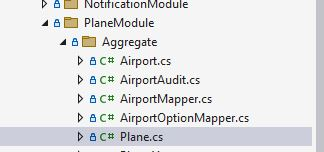

# Create a CRUD (Rest API)
This document explains how to quickly create a CRUD Rest API from zero.
It means that you will see all the files to be modified from the DB mapping to the controller:
- Into the Domain layer you have to code an Entity corresponding to your table in the database.
- Into the Infrastructure Layer, you have to code the mapping between the database and the new entity.
- Into the Application Layer, you have to code a new service to manage the operations done on the entity.
  - Create,
  - Read or Querying with or without filter, pagination,
  - Update
  - Delete.
- Into the Presentation Layer, you have to code the Rest API corresponding to the CRUD operations.
  
_For this example, we imagine that we want to create a new feature with the name: [color=#327f00]Plane[/color]._


## Prerequisite
The database is created.

## 1. Create files manually
### 1.1 Create the entity
#### Aggregate folder 
The first code to write is the Entity. The entity have to located into a Module folder and a child Aggregate folder.
The Aggregate folder can content several entities. The concept of Aggregate come from Domain Driven Design. 
In summary, we can considerate that an entity in relationship with the main entity of an aggregate can be remove when the main entity is deleted.



#### Code
The entity class have to inherit of VersionedTable and IEntity which is parametrized by key type.

#### Team constraint
The Bia Framework provides for data segregation and user role management by Team. So all entity must be :
- either an other entity as parent 
- or a entity representing a Team.
  
Here the entity representing a Team is Site.
With this segregation, a Plane created by a user of site A cannot be consulted by a user of an other site B.

For Team concept consult the specific page [Team](../15-RightManagement/20-Teams.md) 

```csharp
// BIADemo only
// <copyright file="Plane.cs" company="TheBIADevCompany">
//     Copyright (c) TheBIADevCompany. All rights reserved.
// </copyright>

namespace TheBIADevCompany.BIADemo.Domain.PlaneModule.Aggregate
{
    using System;
    using System.Collections.Generic;
    using System.ComponentModel.DataAnnotations.Schema;
    using BIA.Net.Core.Domain;
    using TheBIADevCompany.BIADemo.Domain.SiteModule.Aggregate;

    /// <summary>
    /// The plane entity.
    /// </summary>
    public class Plane : VersionedTable, IEntity<int>
    {
        /// <summary>
        /// Gets or sets the id.
        /// </summary>
        public int Id { get; set; }

        /// <summary>
        /// Gets or sets the Manufacturer's Serial Number.
        /// </summary>
        public string Msn { get; set; }

        ...

        /// <summary>
        /// Gets or sets the last flight date.
        /// </summary>
        public DateTime? LastFlightDate { get; set; }

        /// <summary>
        /// Gets or sets the delivery date.
        /// </summary>
        [Column(TypeName = "date")]
        public DateTime? DeliveryDate { get; set; }

        /// <summary>
        /// Gets or sets the daily synchronization hour.
        /// </summary>
        [Column(TypeName = "time")]
        public TimeSpan? SyncTime { get; set; }

        ...

        /// <summary>
        /// Gets or sets the site id.
        /// </summary>
        public int SiteId { get; set; }

        /// <summary>
        /// Gets or sets the  plane type.
        /// </summary>
        public virtual PlaneType PlaneType { get; set; }

        /// <summary>
        /// Gets or sets the plane type id.
        /// </summary>
        public int? PlaneTypeId { get; set; }
    }
}
```

### 1.2 Model Builder file
Now the entity is created, we can create the ModelBuilder file corresponding into the InfrastructureData project. 
Each feature has a ModelBuilder file prefixed by the name of the feature. For example PlaneModelBuilder.cs.

Theses files are included into the DataContext file.

Here you can see the example of Plane Model Builder file.
As an aggregate can have several classes, a modelBuilder file can describe several tables.


```csharp
namespace TheBIADevCompany.BIADemo.Infrastructure.Data.ModelBuilders
{
    using Microsoft.EntityFrameworkCore;
    using Microsoft.Extensions.Hosting;
    using TheBIADevCompany.BIADemo.Domain.PlaneModule.Aggregate;

    /// <summary>
    /// Class used to update the model builder for plane domain.
    /// </summary>
    public static class PlaneModelBuilder
    {
        /// <summary>
        /// Create the model for projects.
        /// </summary>
        /// <param name="modelBuilder">The model builder.</param>
        public static void CreateModel(ModelBuilder modelBuilder)
        {
            CreatePlaneModel(modelBuilder);
            CreatePlaneTypeModel(modelBuilder);
            CreateAirportModel(modelBuilder);
        }

        /// <summary>
        /// Create the model for planes.
        /// </summary>
        /// <param name="modelBuilder">The model builder.</param>
        private static void CreatePlaneModel(ModelBuilder modelBuilder)
        {
            modelBuilder.Entity<Plane>().HasKey(p => p.Id);
            modelBuilder.Entity<Plane>().Property(p => p.SiteId).IsRequired(); // relationship 1-*
            modelBuilder.Entity<Plane>().Property(p => p.PlaneTypeId).IsRequired(false); // relationship 0..1-*
            modelBuilder.Entity<Plane>().Property(p => p.Msn).IsRequired().HasMaxLength(64);
            modelBuilder.Entity<Plane>().Property(p => p.IsActive).IsRequired();
            modelBuilder.Entity<Plane>().Property(p => p.LastFlightDate).IsRequired(false);
            modelBuilder.Entity<Plane>().Property(p => p.DeliveryDate).IsRequired(false);
            modelBuilder.Entity<Plane>().Property(p => p.SyncTime).IsRequired(false);
            modelBuilder.Entity<Plane>().Property(p => p.Capacity).IsRequired();
            modelBuilder.Entity<Plane>()
                .HasMany(p => p.ConnectingAirports)
                .WithMany(a => a.ClientPlanes)
                .UsingEntity<PlaneAirport>();
        }

        /// <summary>
        /// Create the model for planes.
        /// </summary>
        /// <param name="modelBuilder">The model builder.</param>
        private static void CreatePlaneTypeModel(ModelBuilder modelBuilder)
        {
            modelBuilder.Entity<PlaneType>().HasKey(p => p.Id);
            modelBuilder.Entity<PlaneType>().Property(p => p.Title).IsRequired().HasMaxLength(64);
            modelBuilder.Entity<PlaneType>().Property(p => p.CertificationDate).IsRequired(false);
        }

        /// <summary>
        /// Create the model for airports.
        /// </summary>
        /// <param name="modelBuilder">The model builder.</param>
        private static void CreateAirportModel(ModelBuilder modelBuilder)
        {
            modelBuilder.Entity<Airport>().HasKey(p => p.Id);
            modelBuilder.Entity<Airport>().Property(p => p.Name).IsRequired().HasMaxLength(64);
            modelBuilder.Entity<Airport>().Property(p => p.City).IsRequired().HasMaxLength(64);
        }
    }
}
```

### 1.3 DataContext file
After creating the model builder file, we can modify the DataContext file to :
- add the DBSet
- add the call to the model builder class.


```csharp
        /// <summary>
        /// Gets or sets the Plane DBSet.
        /// </summary>
        public DbSet<Plane> Planes { get; set; }

        ...
        /// <inheritdoc cref="DbContext.OnModelCreating"/>
        protected override void OnModelCreating(ModelBuilder modelBuilder)
        {
            // modelBuilder.HasDefaultSchema("dbo")
            base.OnModelCreating(modelBuilder);
            ...
            // Begin BIADemo
            PlaneModelBuilder.CreateModel(modelBuilder);
        }
```

The call of model builder class must be coded after //Begin BIADemo in order to preserve the future Framework evolution.

### 1.4 DTO file
The DTO code represent two concepts: 
- data coming from the front,
- data contained into the resource managed by a Rest API.
  
In CRUD feature, the Rest API resource contains the same properties of the corresponding entity excepted for the relationship.

```csharp
 /// <summary>
 /// The DTO used to represent a plane.
 /// </summary>
 [BiaDtoClass(AncestorTeam = "Site")]
 public class PlaneDto : BaseDto<int>
 {
    /// <summary>
    /// Gets or sets the Manufacturer's Serial Number.
    /// </summary>
    [BIADtoField(Required = true)]
    public string Msn { get; set; }

    ...

    /// <summary>
    /// Gets or sets the last flight date and time.
    /// </summary>
    [BIADtoField(Type = "datetime", Required = false)]
    public DateTime? LastFlightDate { get; set; }

    /// <summary>
    /// Gets or sets the delivery date.
    /// </summary>
    [BIADtoField(Type = "date", Required = false)]
    public DateTime? DeliveryDate { get; set; }

    /// <summary>
    /// Gets or sets the daily synchronization hour.
    /// </summary>
    [BIADtoField(Type = "time")]
    public string SyncTime { get; set; }

    ...

    /// <summary>
    /// Gets or sets the site.
    /// </summary>
    [BIADtoField(IsParent = true, Required = true)]
    public int SiteId { get; set; }

    /// <summary>
    /// Gets or sets the  plane type title.
    /// </summary>
    [BiaDtoField(ItemType = "PlaneType")]
    public OptionDto PlaneType { get; set; }

    /// <summary>
    /// Gets or sets the list of connecting airports.
    /// </summary>
    [BiaDtoField(ItemType = "Airport")]
    public ICollection<OptionDto> ConnectingAirports { get; set; }
 }
```

A entity with relationships to other entity has a DTO where all relationship as converted to an OptionDto (*'PlaneType'* on your example).
For OptionDto concept you can consult the specific page [OptionDto](80-OptionDTO.md).

_Dto entity class can have specific annotation_.
For the class, use __'BiaDtoClass'__, to specify:
* 'AncestorTeam' (Specify the ancestor team, essentially used to filter views by team)

For each attribute, use __'BIADtoField'__ annotation to specify: 
* 'Type' as explicit type: datetime, date (only) or time (only).
* 'Required' if attribute is mandatory or no (*false* by default if attribute is missing).
* 'IsParent' to define parent relationship.
* 'ItemType' to define target 'Type' for 1-n or n-n relationship (The "type" replaced by "OptionDto" on dto file).

### 1.5 Mapper file
The Mapper contain two methods in order to convert entity to Dto and vice versa.

There is also methods used to filtering during the querying operations.

The method __DtoToRecord__ is used during the csv extract function to convert entity to csv record.

You can see in PlaneMapper class of BiaDemo project, how theses methods are implemented.

## 2. Update the DataBase
After that you have to update the database with following commands into Package Manager Console:

```csharp
Add-Migration 'XYZ' -Context DataContext 
``` 
*replace 'XYZ' by your own name (for example: newFeaturePlane)*

and
```csharp
Update-DataBase -Context DataContext
```

## 3. Finalize CRUD generation automatically
All previous steps are **mandatory** to finalize back-end CRUD generation. 
Use the BIAToolKit on [CRUD Generation](../../30-BIAToolKit/50-CreateCRUD.md) tab with (at least) _'WebApi'_ (for generation) and _'CRUD'_ (for Generation Type) checkboxes checked to automatically:
- Generate
  * ApplicationService files 
  * Controller file 
- Update:
  * Right file
  * Permission into bianetconfig file
  * IocContainer file

Automatically back-end CRUD generation can be done in same time of [front-end](./20-CreateACRUD.md) CRUD generation, but back-end generation can be done independently.

### 3.1 ApplicationService file
The ApplicationService code inherit of CrudAppServiceBase which implement all the methods necessary for CRUD operations.

### 3.2 Controller file
The Controller inherit of BiaControllerBase and implement all method corresponding to the CRUD operation and more.

The controller have conditional code determinate by the variable <i>UseHubForClientInPlane</i>.
This mean that if define, the controller manage SignalR hub to send message to the client front.
Be careful to the configuration of signalR URL. On local execution with IIExpress, the url must be like that : 
```"SignalRUrl": "http://localhost:54321/HubForClients" ```.

### 3.3 Right file
The methods into the controller are subject to authorization. 
Each new feature has his static class into the _Right.cs_ file.
This file is into CrossCutting.Common project.

### 3.4 Permission into bianetconfig file
This file configure permissions corresponding to the role.

### 3.5 IocContainer file
This last file contains service declaration.

