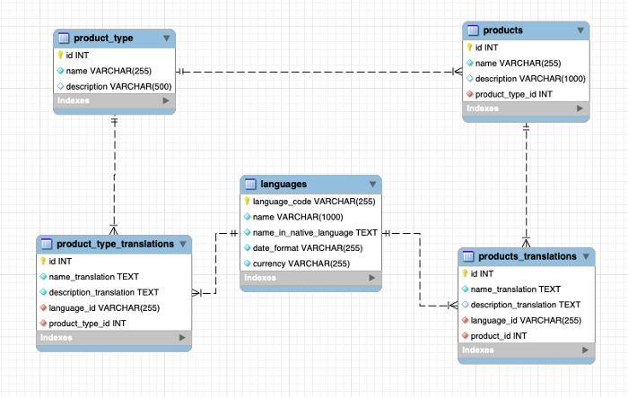

# Translation server side
This file explains what to add the translation on some fields on an existing entity.

## Prerequisite

### Knowledge to have:
* [Different possible approach](https://medium.com/walkin/database-internationalization-i18n-localization-l10n-design-patterns-94ff372375c6)

Within the framework of the BIA, the chosen approach is **Separate translation table approach** : 
In this approach Instead of putting all translation under the same table, we will write a separate translation table for each table which requires localization.



## Implementation

### Back
* Create the translation table entity in Domain/TranslationModule/Aggregate. 
  * it should contain :
    * an id
    * a link on language (Language + LanguageId)
    * a link on the entity to translate (Notification + NotificationId in this example)
    * the fields to translate (Title + Description in this example).
    ``` csharp
        /// <summary>
    /// The role entity.
    /// </summary>
    public class NotificationTranslation : VersionedTable, IEntity
    {
        /// <summary>
        /// Gets or sets the id.
        /// </summary>
        public int Id { get; set; }

        /// <summary>
        /// Gets or sets the language.
        /// </summary>
        public Language Language { get; set; }

        /// <summary>
        /// Gets or sets the language id.
        /// </summary>
        public int LanguageId { get; set; }

        /// <summary>
        ///  Gets or sets the notification type.
        /// </summary>
        public Notification Notification { get; set; }

        /// <summary>
        /// Gets or sets the notification type id.
        /// </summary>
        public int NotificationId { get; set; }

        /// <summary>
        /// Gets or sets the title translated.
        /// </summary>
        public string Title { get; set; }

        /// <summary>
        /// Gets or sets the description translated.
        /// </summary>
        public string Description { get; set; }
    }
    ```
* Add the function to define the model with constraint (and Data if required) in Infrastructure.Data/ModelsBuilders/TranslationModelBuilder.cs
  * it should contain :
    * the HasKey(r => r.Id)
    * the required constraint on LanguageId and the entity to translate id (NotificationId  in this example)
    * the HasIndex on those 2 keys (to avoid duplication of translation on same language and same entity)
    * the constraint on fields to translate. it should be identical to the constraints in the entity required or not, length... (Title + Description in this example).
    ``` csharp
            /// <summary>
        /// Create the model for notification.
        /// </summary>
        /// <param name="modelBuilder">The model builder.</param>
        private static void CreateNotificationTranslationModel(ModelBuilder modelBuilder)
        {
            modelBuilder.Entity<NotificationTranslation>().HasKey(r => r.Id);
            modelBuilder.Entity<NotificationTranslation>().Property(r => r.NotificationId).IsRequired();
            modelBuilder.Entity<NotificationTranslation>().Property(r => r.LanguageId).IsRequired();
            modelBuilder.Entity<NotificationTranslation>().HasIndex(u => new { u.NotificationId, u.LanguageId }).IsUnique();

            modelBuilder.Entity<NotificationTranslation>().Property(m => m.Title).IsRequired().HasMaxLength(100);
            modelBuilder.Entity<NotificationTranslation>().Property(m => m.Description).IsRequired().HasMaxLength(256);
        }
    ```
  * in case of data to enter at migration add the translation in all language in this function:
    * increment the id of 100 when changing of entity (in case of adding language in the future)
    * example of adding notification Type translation in French, spanish and german.
    ``` csharp
            modelBuilder.Entity<NotificationTypeTranslation>().HasData(new NotificationTypeTranslation { NotificationTypeId = 1, LanguageId = LanguageId.French, Id = 101, Label = "Tâche" });
            modelBuilder.Entity<NotificationTypeTranslation>().HasData(new NotificationTypeTranslation { NotificationTypeId = 1, LanguageId = LanguageId.Spanish, Id = 102, Label = "Tarea" });
            modelBuilder.Entity<NotificationTypeTranslation>().HasData(new NotificationTypeTranslation { NotificationTypeId = 1, LanguageId = LanguageId.German, Id = 103, Label = "Aufgabe" });

            modelBuilder.Entity<NotificationTypeTranslation>().HasData(new NotificationTypeTranslation { NotificationTypeId = 2, LanguageId = LanguageId.French, Id = 201, Label = "Information" });
            modelBuilder.Entity<NotificationTypeTranslation>().HasData(new NotificationTypeTranslation { NotificationTypeId = 2, LanguageId = LanguageId.Spanish, Id = 202, Label = "Información" });
            modelBuilder.Entity<NotificationTypeTranslation>().HasData(new NotificationTypeTranslation { NotificationTypeId = 2, LanguageId = LanguageId.German, Id = 203, Label = "Information" });

            modelBuilder.Entity<NotificationTypeTranslation>().HasData(new NotificationTypeTranslation { NotificationTypeId = 3, LanguageId = LanguageId.French, Id = 301, Label = "Succès" });
            modelBuilder.Entity<NotificationTypeTranslation>().HasData(new NotificationTypeTranslation { NotificationTypeId = 3, LanguageId = LanguageId.Spanish, Id = 302, Label = "Éxito" });
            modelBuilder.Entity<NotificationTypeTranslation>().HasData(new NotificationTypeTranslation { NotificationTypeId = 3, LanguageId = LanguageId.German, Id = 303, Label = "Erfolg" });

            modelBuilder.Entity<NotificationTypeTranslation>().HasData(new NotificationTypeTranslation { NotificationTypeId = 4, LanguageId = LanguageId.French, Id = 401, Label = "Avertissement" });
            modelBuilder.Entity<NotificationTypeTranslation>().HasData(new NotificationTypeTranslation { NotificationTypeId = 4, LanguageId = LanguageId.Spanish, Id = 402, Label = "Advertencia" });
            modelBuilder.Entity<NotificationTypeTranslation>().HasData(new NotificationTypeTranslation { NotificationTypeId = 4, LanguageId = LanguageId.German, Id = 403, Label = "Erwärmen" });

            modelBuilder.Entity<NotificationTypeTranslation>().HasData(new NotificationTypeTranslation { NotificationTypeId = 5, LanguageId = LanguageId.French, Id = 501, Label = "Erreur" });
            modelBuilder.Entity<NotificationTypeTranslation>().HasData(new NotificationTypeTranslation { NotificationTypeId = 5, LanguageId = LanguageId.Spanish, Id = 502, Label = "Culpa" });
            modelBuilder.Entity<NotificationTypeTranslation>().HasData(new NotificationTypeTranslation { NotificationTypeId = 5, LanguageId = LanguageId.German, Id = 503, Label = "Fehler" });
    ```

* Add the **User Context** initialization in service constructor. ex in role service:
    ``` csharp
        /// <summary>
        /// Initializes a new instance of the <see cref="RoleAppService"/> class.
        /// </summary>
        /// <param name="repository">The repository.</param>
        /// <param name="principal">The principal.</param>
        public RoleAppService(ITGenericRepository<Role> repository, IPrincipal principal, UserContext userContext)
            : base(repository)
        {
            this.principal = principal as BIAClaimsPrincipal;
            this.userContext = userContext;
        }
    ```
* Adapt the dto (if not optionDto)
  * add translated fields:
    ``` csharp
          /// <summary>
        /// Gets or sets the title.
        /// </summary>
        public string Title { get; set; }

        /// <summary>
        /// Gets or sets the title translated.
        /// </summary>
        public string TitleTranslated { get; set; }

        /// <summary>
        /// Gets or sets the description.
        /// </summary>
        public string Description { get; set; }

        /// <summary>
        /// Gets or sets the description translated.
        /// </summary>
        public string DescriptionTranslated { get; set; }
    ```
* Adapt the mapper:
  * ex for an optionDto in EntityToDto():
    * without translation
    ``` csharp
        Display = entity.Label,
    ```
    * with translation
    ``` csharp
        Display = entity.RoleTranslations.Where(rt => rt.Language.Code == this.UserContext.Language).Select(rt => rt.Label).FirstOrDefault() ?? entity.Label,
    ```
  *  for an entity display in CRUD
    *  translate for sort and filter in `ExpressionCollection<Notification>`
    *  for display in EntityToDto() add :
    ``` csharp
        TitleTranslated = entity.NotificationTranslations.Where(rt => rt.Language.Code == this.UserContext.Language).Select(rt => rt.Title).FirstOrDefault() ?? entity.Title,
        DescriptionTranslated = entity.NotificationTranslations.Where(rt => rt.Language.Code == this.UserContext.Language).Select(rt => rt.Description).FirstOrDefault() ?? entity.Description,
    ```
    * for item only ( if (mapperMode == MapperMode.Item)) retrieve all translation (see example in NotificationMapper):
    ``` csharp
            NotificationTranslations = entity.NotificationTranslations.Select(nt => new NotificationTranslationDto
            {
                DtoState = DtoState.Unchanged,
                Id = nt.Id,
                LanguageId = nt.LanguageId,
                Title = nt.Title,
                Description = nt.Description,
            }).ToList(),
    ```

### Back
