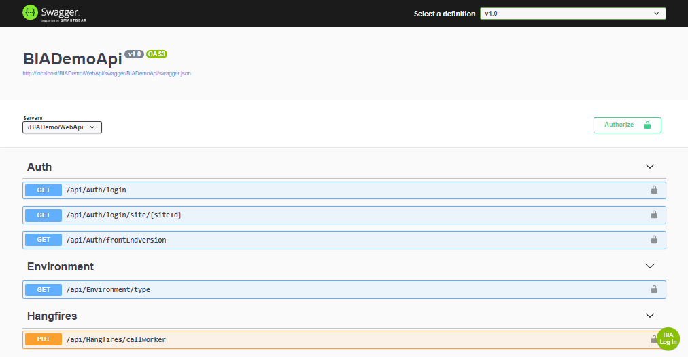

# Swagger (Api Feature)
This file explains what to use the Swagger feature in your V3 project.

## Prerequisite

### Knowledge to have:
* [Swagger official site](https://swagger.io/)

## Overview
### User interface:
Swagger open a user interface to launch and test the web api develop in the project.



This interface is accessible with the path /swagger relative to the root of your Presentation.api application.

### BIA customizing:
In the BIA Framework a button is added at the bottom right to authenticate the user with SSO using JWT token.

## Activation
### bianetconfig.Development.json
In the BIANet Section add:
``` json
    "ApiFeatures": {
      "Swagger": {
        "Activate": true
      }
    },
```
### recommendation
It is not recommended to Activate this feature in UAT and Production. It can be activate in Integration only for test.

It is recommended to configure your Presentation.Api project in Visual Studio to launch the swagger UI at start of debug:

